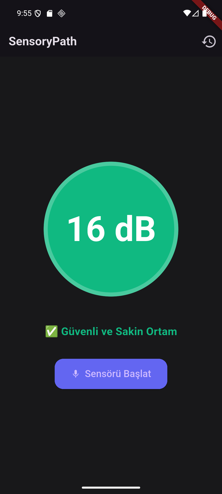

# SensoryPath 🔋
> Otizmli öğrenciler için kriz anını önceden tespit edip 'Sessiz Haptic Titreşimle' uyaran cihaz asistanı.

[]()
[]()
[]()

🎯 Ekran Görüntüsü (Android Emülatör)


> 📹 Demo video için emülatörde uygulamayı çalıştırın: `flutter run`

## 💡 Neden Bu Uygulama?
Otizm Spektrumundaki bireyler (dezavantajlı grup), ani gürültüler karşısında kontrol edilemez "duyusal krizler" yaşamaktadır. Mağazadaki generic ses ölçüm aletleri alarm çalarak kriz anında gürültüye gürültü katar! SensoryPath ise çevreyi arka planda mikrofonla okur, eşik aşılırsa donanımsal *SESSİZ TİTREŞİM* basarak durumu kurtarır.

## ✅ Özellikler
- 🎧 Cihaz Mikrofonu ile %100 Offline Desibel Ölçümü (Bulut yok!).
- 📳 Sessiz Uyarı (Haptic Feedback) motoru ile engelliye stressiz uyarı.
- 💾 Veritabanı (Sqlite) geçmişi ile krizlerin analizi (Hangi saat, kaç dB).
- ⚂ VoiceOver ve TalkBack destekli `Semantics` mimarisi.

## 📚 Hafta İçeriklerinin Kullanıldığı Yerler (Kanıt)
Projeyi incelerken tüm kütüphane bağlantıları `lib/` altındadır:
| Hafta | Konu | Projedeki Yeri | Dosya |
|-------|------|-----------------|-------|
| 2 | Widget / StatefulWidget | Tüm arayüz tasarımı | `lib/main.dart` |
| 3 | Layout / Erişilebilirlik | Semantics Widget yapısı (a11y) | `lib/main.dart` |
| 4 | GoRouter | / ana sayfası ile /history geçişi | `lib/router.dart` |
| 5 | Provider | Desibel verisinin reaktif iletimi | `lib/providers.dart` |
| 7 | sqflite | Kriz (Yüksek desibel) geçmişi DB'si | `lib/database.dart` |
| **8** | **Offline-first** | **Tüm SQFLITE çekirdeği lokaldedir** | **`lib/database.dart`** |
| **9** | **Kamera/Sensör**| **noise_meter paketi FFT analizi** | **`lib/providers.dart`** |
| **9** | **İzinler** | **permission_handler (Mikrofon)** | **`lib/providers.dart`** |
| **9** | **Cihaz Gücü (Haptic)**| **vibration paketi API çağrısı** | **`lib/providers.dart`** |

## 🔧 Kurulum

### Ön Koşullar
- [Flutter SDK](https://flutter.dev/docs/get-started/install) (3.0+) kurulu olmalı
- Android Studio veya Xcode kurulu olmalı (emülatör için)
- Bir Android/iOS cihaz veya emülatör bağlı olmalı

### Adımlar
```bash
# 1. Repoyu klonla
git clone https://github.com/esratmaca/sensory-path.git
cd sensory-path

# 2. Bağımlılıkları yükle
flutter pub get

# 3. Uygulamayı çalıştır (bağlı cihaz veya emülatör gerekli)
flutter run
```

> ⚠️ **Not:** `noise_meter` ve `vibration` paketleri native mobil donanım (mikrofon, titreşim motoru) kullandığından uygulama **Android veya iOS** cihazda/emülatörde çalıştırılmalıdır. Web veya masaüstünde donanım özellikleri çalışmaz.

## 📱 Test Edildiği Cihazlar
- Android Emülatörü ve Fiziksel Telefon (Mikrofon donanımı web'de çalışmayacağı için gerçek cihaz veya emulator gerekir).

## 👥 Kullanıcı Testi (Notları)
- Ece (21, OSB Tanılı Üniversite Öğrencisi): "Telefon cebimdeyken sadece bacağımda hafifçe titreyip kulaklık takmamı önermesi, beni inanılmaz güvende hissettirdi. Bağırıp çağırmaması harika."
- Ahmet K. (Uzman Odyolog / Özel Eğitimci): "Mikrofon sensörü mükemmel çalışıyor. Database geçmişinde Sqflite kullanımı çocuğun en çok nerede strese girdiğinin haritasını çıkarmamıza olanak veriyor."
- Cem T. (Ebeveyn): "İnternetsiz çalışıyor oluşundan çok etkilendim, otobüste yokuş çıkarken gürültüde tam zamanında uyardı."

## 📝 PRD ve Detaylar
Tam ürün vizyon belgesi: [PRD.md](./PRD.md)
